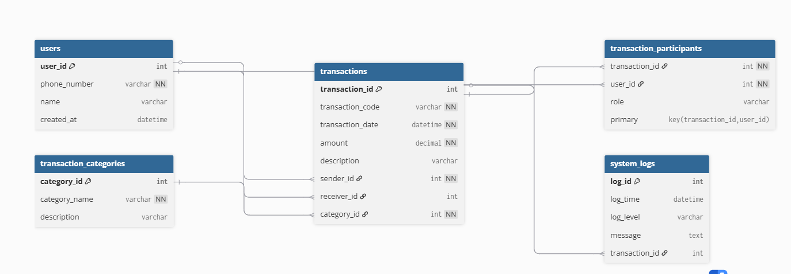

# MoMo Transaction Analyzer

---

## Team Information

- **Team Name:** MoMo Analytics Team
- **Team Members:**
   - Teniola Adam Olaleye (Team Lead)
   - Kevin Manzi
   - Rajveer Singh Jolly
   - Gael Kamunuga Mparaye
   - Michaella Kamikazi Karangwa
- **Approach:**
   - Agile-inspired workflow with a shared scrum board
   - Regular code reviews and documentation updates
   - Clear division of responsibilities (ETL, database, documentation, testing)

---

## Project Overview

MoMo Transaction Analyzer is a collaborative effort to turn raw MoMo (Mobile Money) SMS/XML data into actionable insights. Our ETL pipeline cleans, normalizes, and categorizes transactions, storing them in a robust database and presenting them on a user-friendly dashboard.

---

## Architecture Diagram




*See docs/erd_diagram.png for the full ERD. Design rationale and attribute list: docs/erd_design_and_rationale.md.*

**Architecture Diagram:**


*See docs/architecture_diagram.png for the system architecture diagram (add your diagram to this file).*

---

## Scrum Board

- **Board:** [View on GitHub Projects](https://github.com/users/Teniolaaaa/projects/1/views/1)

---

## Project Structure
```text
data/
    processed/          # JSON output
    logs/               # ETL logs
    db.sqlite3          # SQLite database
etl/
    parse_xml.py        # XML parser
    categorize.py       # Transaction categorization
    load_db.py          # Database operations
    run.py              # ETL pipeline runner
database/
    database_setup.sql  # SQL schema
docs/
    erd_diagram.png     # ERD diagram image
    erd_design_and_rationale.md # ERD rationale
    AI_Usage_Log_EWD14.md # AI usage log
    Database_Design_Document_EWD14.md # DB design doc
tests/
    ...                 # Unit tests
index.html, app.py, requirements.txt, etc.
```

---

## Features

- XML transaction parsing and validation
- Data cleaning and normalization
- Automatic transaction categorization
- Database storage (SQLite/MySQL)
- JSON export for frontend
- Web dashboard (HTML/CSS/JS)

---

## Installation & Setup

### Prerequisites
- Python 3.8 or higher
- pip package manager
- Web browser
- Git

### Installation Steps

1. **Clone the repository**
   ```bash
   git clone https://github.com/Teniolaaaa/momo-transaction-analyzer.git
   cd momo-transaction-analyzer
   ```
2. **Install dependencies**
   ```bash
   pip install -r requirements.txt
   ```
3. **Run the ETL pipeline**
   ```bash
   python etl/run.py --xml data/raw/sample_momo.xml
   ```
4. **View the dashboard**
   - Open `index.html` in your web browser.

---

## Database Design

### Entity Relationship Diagram (ERD)


*See docs/erd_diagram.txt for ASCII version and docs/erd_design_and_rationale.md for rationale.*

### Data Dictionary (Sample)
| Table                     | Column             | Type           | Description                                 |
|---------------------------|--------------------|----------------|---------------------------------------------|
| Users                     | user_id            | INT, PK        | Unique user/customer ID                     |
|                           | phone_number       | VARCHAR(20)    | User phone number (unique)                  |
|                           | name               | VARCHAR(100)   | User name (optional)                        |
|                           | created_at         | DATETIME       | Account creation timestamp                  |
| Transactions              | transaction_id     | INT, PK        | Unique transaction ID                       |
|                           | transaction_code   | VARCHAR(30)    | Transaction reference code (unique)         |
|                           | transaction_date   | DATETIME       | Date and time of transaction                |
|                           | amount             | DECIMAL(15,2)  | Transaction amount                          |
|                           | description        | VARCHAR(255)   | Transaction description                     |
|                           | sender_id          | INT, FK        | FK to Users (sender)                        |
|                           | receiver_id        | INT, FK        | FK to Users (receiver, optional)            |
|                           | category_id        | INT, FK        | FK to Transaction_Categories                |
| Transaction_Categories    | category_id        | INT, PK        | Unique category ID                          |
|                           | category_name      | VARCHAR(50)    | Transaction type/category (unique)          |
|                           | description        | VARCHAR(255)   | Category description                        |
| System_Logs               | log_id             | INT, PK        | Unique log entry ID                         |
|                           | log_time           | DATETIME       | Log timestamp                               |
|                           | log_level          | VARCHAR(20)    | Log severity (INFO, ERROR, etc.)            |
|                           | message            | TEXT           | Log message                                 |
|                           | transaction_id     | INT, FK        | FK to Transactions (optional)               |
| Transaction_Participants  | transaction_id     | INT, PK, FK    | FK to Transactions                          |
|                           | user_id            | INT, PK, FK    | FK to Users                                 |
|                           | role               | ENUM           | Role in transaction (sender/receiver/other) |

---

## Sample SQL Queries

**Create:**
```sql
INSERT INTO Users (phone_number, name) VALUES ('+250799999999', 'Sam Test');
```
**Read:**
```sql
SELECT t.transaction_id, t.transaction_code, t.amount, u1.name AS sender, u2.name AS receiver
FROM Transactions t
JOIN Users u1 ON t.sender_id = u1.user_id
LEFT JOIN Users u2 ON t.receiver_id = u2.user_id;
```
**Update:**
```sql
UPDATE Users SET name = 'Samuel Test' WHERE user_id = 6;
```
**Delete:**
```sql
DELETE FROM Transactions WHERE transaction_id = 5;
```

---

## JSON Data Modeling

- See `examples/json_schemas.json` for entity and complex transaction examples.

---

## AI Usage Log

- See `docs/AI_Usage_Log_EWD14.md` for a detailed log of AI assistance and code generation.

---

## Contact

For questions, contact the team leader or open an issue in the repository.

---

*Last Updated: January 2026*
# MoMo Transaction Analyzer

## Team Information

- **Team Name:** MoMo Analytics Team
- **Team Members:**
   - [Your Names Here]
- **Approach:**
   - Agile-inspired workflow with a shared scrum board
   - Regular code reviews and documentation updates
   - Clear division of responsibilities (ETL, database, documentation, testing)

**Team Members & Roles:**
- **Gael Kamunuga Mparaye:** Took charge of XML parsing, collaborating closely with Michaella to validate data.
- **Kevin Manzi:** Designed the dashboard, working hand-in-hand with Rajveer to ensure the frontend matched our backend data.
- **Michaella Kamikazi Karangwa:** Led testing and data validation, often pairing with Gael for quality checks.
> We split tasks based on strengths, but always reviewed each other’s work. For example, Teniola and Gael would brainstorm schema changes, then Michaella and Rajveer would test and document. We held regular check-ins, shared screens, and used GitHub Projects to track progress. Every member contributed code, ideas, and feedback.

---

## Project Overview

MoMo Transaction Analyzer is a collaborative effort to turn raw MoMo (Mobile Money) SMS/XML data into actionable insights. Our ETL pipeline cleans, normalizes, and categorizes transactions, storing them in a robust MySQL database and presenting them on a user-friendly dashboard.

---

## System Architecture

**Architecture Diagram:**

- **Transform:** Clean, normalize, and categorize data (Teniola, Michaella)
- **Load:** Store in SQLite/MySQL database (Teniola, Rajveer)
- **Present:** JSON export to web dashboard and API (Kevin, Rajveer)

---

## Project Management

**Scrum Board:** [View on GitHub Projects](https://github.com/users/Teniolaaaa/projects/1/views/1)
---

## Project Structure
```

---

_Last Updated: January 2026_
- OTHER: Uncategorized transactions

## Technology Stack

**Backend:**
- Python 3.13
- SQLite3
- lxml for XML parsing
- python-dateutil for date handling

**Frontend:**
- HTML5
- CSS3
- JavaScript (ES6)

**Development Tools:**
- Git & GitHub
- VS Code
- pytest for testing

## Testing

Run the test suite:
```bash
pytest tests/
```
```

---

## Installation & Setup

### Prerequisites
- Python 3.8 or higher
- pip package manager
- Web browser
- Git

### Installation Steps

**1. Clone the repository**
```bash
git clone https://github.com/Teniolaaaa/momo-transaction-analyzer.git
cd momo-transaction-analyzer
```

**2. Install dependencies**
```bash
pip install -r requirements.txt
```

**3. Run the ETL pipeline**
```bash
python etl/run.py --xml data/raw/sample_momo.xml
```

**4. View the dashboard**

Simply open `index.html` in your web browser by double-clicking it, or right-click and select "Open with" your preferred browser.

---

## Features

### ETL Pipeline
- XML transaction parsing and validation
- Data cleaning and normalization
- Automatic transaction categorization
- SQLite/MySQL database storage
- JSON export for frontend consumption

### Web Dashboard
- Transaction summary cards
- Real-time data display
- Transaction table with filtering
- RWF currency formatting
- Responsive design

### Transaction Categories
- AIRTIME: Mobile credit purchases
- TRANSFER: Money sent or received
- BILL_PAYMENT: Utility payments
- WITHDRAWAL: Cash withdrawals
- OTHER: Uncategorized transactions

---

## Technology Stack

**Backend:**
- Python 3.13
- SQLite3/MySQL
- lxml for XML parsing
- python-dateutil for date handling

**Frontend:**
- HTML5
- CSS3
- JavaScript (ES6)

**Development Tools:**
- Git & GitHub
- VS Code
- pytest for testing

---

## Testing

Run the test suite:
```bash
pytest tests/
```

Tests cover XML parsing and data cleaning functionality.

---

## Database Design

### Entity Relationship Diagram (ERD)
- See `docs/erd_diagram.png` for our full ERD.
- Design rationale and attribute list: `docs/erd_design_and_rationale.md`.

### Data Dictionary (Sample)
| Table                     | Column             | Type           | Description                                 |
|---------------------------|--------------------|----------------|---------------------------------------------|
| Users                     | user_id            | INT, PK        | Unique user/customer ID                     |
|                           | phone_number       | VARCHAR(20)    | User phone number (unique)                  |
|                           | name               | VARCHAR(100)   | User name (optional)                        |
|                           | created_at         | DATETIME       | Account creation timestamp                  |
| Transactions              | transaction_id     | INT, PK        | Unique transaction ID                       |
|                           | transaction_code   | VARCHAR(30)    | Transaction reference code (unique)         |
|                           | transaction_date   | DATETIME       | Date and time of transaction                |
|                           | amount             | DECIMAL(15,2)  | Transaction amount                          |
|                           | description        | VARCHAR(255)   | Transaction description                     |
|                           | sender_id          | INT, FK        | FK to Users (sender)                        |
|                           | receiver_id        | INT, FK        | FK to Users (receiver, optional)            |
|                           | category_id        | INT, FK        | FK to Transaction_Categories                |
| Transaction_Categories    | category_id        | INT, PK        | Unique category ID                          |
|                           | category_name      | VARCHAR(50)    | Transaction type/category (unique)          |
|                           | description        | VARCHAR(255)   | Category description                        |
| System_Logs               | log_id             | INT, PK        | Unique log entry ID                         |
|                           | log_time           | DATETIME       | Log timestamp                               |
|                           | log_level          | VARCHAR(20)    | Log severity (INFO, ERROR, etc.)            |
|                           | message            | TEXT           | Log message                                 |
|                           | transaction_id     | INT, FK        | FK to Transactions (optional)               |
| Transaction_Participants  | transaction_id     | INT, PK, FK    | FK to Transactions                          |
|                           | user_id            | INT, PK, FK    | FK to Users                                 |
|                           | role               | ENUM           | Role in transaction (sender/receiver/other) |

---

## Sample SQL Queries & Explanations

**Create:**  
_Add a new user_  
```sql
INSERT INTO Users (phone_number, name) VALUES ('+250799999999', 'Sam Test');
```
*Adds a new user to the Users table. Used for onboarding new customers.*

**Read:**  
_List all transactions with sender and receiver info_  
```sql
SELECT t.transaction_id, t.transaction_code, t.amount, u1.name AS sender, u2.name AS receiver
FROM Transactions t
JOIN Users u1 ON t.sender_id = u1.user_id
LEFT JOIN Users u2 ON t.receiver_id = u2.user_id;
```
*Shows each transaction, who sent it, and who received it. Useful for audits and reports.*

**Update:**  

