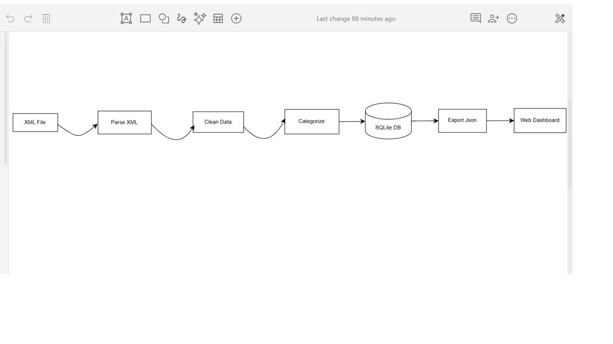

## Team Information
**Team Name:** MoMo Analytics Team

**Team Members:**
 data/
    raw/                # XML input files
    processed/          # JSON output
    logs/               # ETL logs
    db.sqlite3          # SQLite database
 etl/
    parse_xml.py        # XML parser
    clean_normalize.py  # Data cleaning
    categorize.py       # Transaction categorization
    load_db.py          # Database operations
    run.py             # Main ETL script
    config.py          # Configuration
 tests/
    test_parse_xml.py
    test_clean_normalize.py
 api/
     __init__.py         # API endpoints
```

## Installation & Setup

### Prerequisites
- Python 3.8 or higher
# MoMo Transaction Analyzer

## Teamwork at the Core

**Team Name:** MoMo Analytics Team

**Team Members & Roles:**
- **Teniola Adam Olaleye** (Team Lead): Coordinated the project, led the ETL and database design, and ensured everyone’s voice was heard.
- **Gael Kamunuga Mparaye:** Took charge of XML parsing, collaborating closely with Michaella to validate data.
- **Kevin Manzi:** Designed the dashboard, working hand-in-hand with Rajveer to ensure the frontend matched our backend data.
- **Michaella Kamikazi Karangwa:** Led testing and data validation, often pairing with Gael for quality checks.
- **Rajveer Singh Jolly:** Documented our process, kept the README up to date, and helped Kevin with user experience.

> **How We Worked:**  
> We split tasks based on strengths, but always reviewed each other’s work. For example, Teniola and Gael would brainstorm schema changes, then Michaella and Rajveer would test and document. We held regular check-ins, shared screens, and used GitHub Projects to track progress. Every member contributed code, ideas, and feedback.

---

## Project Overview

MoMo Transaction Analyzer is a collaborative effort to turn raw MoMo (Mobile Money) SMS/XML data into actionable insights. Our ETL pipeline cleans, normalizes, and categorizes transactions, storing them in a robust MySQL database and presenting them on a user-friendly dashboard.

---

## System Architecture

- **Extract:** Parse XML transaction files (Gael, Michaella)
- **Transform:** Clean and categorize data (Teniola, Michaella)
- **Load:** Store in MySQL (Teniola, Rajveer)
- **Present:** Dashboard and API (Kevin, Rajveer)

---

## Project Structure
## Database Design

### Entity Relationship Diagram (ERD)
- See `docs/erd_diagram.png` for our full ERD.
- Design rationale and attribute list: `docs/erd_design_and_rationale.md`.

### Data Dictionary (Sample)
| Table                     | Column             | Type           | Description                                 |
|---------------------------|--------------------|----------------|---------------------------------------------|
| Users                     | user_id            | INT, PK        | Unique user/customer ID                     |
|                           | phone_number       | VARCHAR(20)    | User phone number (unique)                  |
|                           | name               | VARCHAR(100)   | User name (optional)                        |
|                           | created_at         | DATETIME       | Account creation timestamp                  |
| Transactions              | transaction_id     | INT, PK        | Unique transaction ID                       |
|                           | transaction_code   | VARCHAR(30)    | Transaction reference code (unique)         |
|                           | transaction_date   | DATETIME       | Date and time of transaction                |
|                           | amount             | DECIMAL(15,2)  | Transaction amount                          |
|                           | description        | VARCHAR(255)   | Transaction description                     |
|                           | sender_id          | INT, FK        | FK to Users (sender)                        |
|                           | receiver_id        | INT, FK        | FK to Users (receiver, optional)            |
|                           | category_id        | INT, FK        | FK to Transaction_Categories                |
| Transaction_Categories    | category_id        | INT, PK        | Unique category ID                          |
|                           | category_name      | VARCHAR(50)    | Transaction type/category (unique)          |
|                           | description        | VARCHAR(255)   | Category description                        |
| System_Logs               | log_id             | INT, PK        | Unique log entry ID                         |
|                           | log_time           | DATETIME       | Log timestamp                               |
|                           | log_level          | VARCHAR(20)    | Log severity (INFO, ERROR, etc.)            |
|                           | message            | TEXT           | Log message                                 |
|                           | transaction_id     | INT, FK        | FK to Transactions (optional)               |
| Transaction_Participants  | transaction_id     | INT, PK, FK    | FK to Transactions                          |

# MoMo Transaction Analyzer

## Team Information
**Team Name:** MoMo Analytics Team

**Team Members:**
- Teniola Adam Olaleye (Group Leader)
- Gael Kamunuga Mparaye
- Kevin Manzi
- Michaella Kamikazi Karangwa
- Rajveer Singh Jolly

## Teamwork at the Core

**Team Members & Roles:**
- **Teniola Adam Olaleye** (Team Lead): Coordinated the project, led the ETL and database design, and ensured everyone’s voice was heard.
- **Gael Kamunuga Mparaye:** Took charge of XML parsing, collaborating closely with Michaella to validate data.
- **Kevin Manzi:** Designed the dashboard, working hand-in-hand with Rajveer to ensure the frontend matched our backend data.
- **Michaella Kamikazi Karangwa:** Led testing and data validation, often pairing with Gael for quality checks.
- **Rajveer Singh Jolly:** Documented our process, kept the README up to date, and helped Kevin with user experience.

> **How We Worked:**  
> We split tasks based on strengths, but always reviewed each other’s work. For example, Teniola and Gael would brainstorm schema changes, then Michaella and Rajveer would test and document. We held regular check-ins, shared screens, and used GitHub Projects to track progress. Every member contributed code, ideas, and feedback.

---

## Project Overview

This project analyzes MoMo (Mobile Money) transaction data from XML files. It cleans up the data, stores it in a database, and displays everything on a web dashboard. We built an ETL pipeline that takes messy transaction XML files and turns them into organized, easy-to-read information.

MoMo Transaction Analyzer is a collaborative effort to turn raw MoMo (Mobile Money) SMS/XML data into actionable insights. Our ETL pipeline cleans, normalizes, and categorizes transactions, storing them in a robust MySQL database and presenting them on a user-friendly dashboard.

---

## System Architecture

**Architecture Diagram:**



The system follows a typical ETL architecture:
- **Extract:** Parse XML transaction files (Gael, Michaella)
- **Transform:** Clean, normalize, and categorize data (Teniola, Michaella)
- **Load:** Store in SQLite/MySQL database (Teniola, Rajveer)
- **Present:** JSON export to web dashboard and API (Kevin, Rajveer)

---

## Project Management

**Scrum Board:** [View on GitHub Projects](https://github.com/users/Teniolaaaa/projects/1/views/1)

---

## Project Structure
```

---

_Last Updated: January 2026_
- OTHER: Uncategorized transactions

## Technology Stack

**Backend:**
- Python 3.13
- SQLite3
- lxml for XML parsing
- python-dateutil for date handling

**Frontend:**
- HTML5
- CSS3
- JavaScript (ES6)

**Development Tools:**
- Git & GitHub
- VS Code
- pytest for testing

## Testing

Run the test suite:
```bash
pytest tests/
```
```

---

## Installation & Setup

### Prerequisites
- Python 3.8 or higher
- pip package manager
- Web browser
- Git

### Installation Steps

**1. Clone the repository**
```bash
git clone https://github.com/Teniolaaaa/momo-transaction-analyzer.git
cd momo-transaction-analyzer
```

**2. Install dependencies**
```bash
pip install -r requirements.txt
```

**3. Run the ETL pipeline**
```bash
python etl/run.py --xml data/raw/sample_momo.xml
```

**4. View the dashboard**

Simply open `index.html` in your web browser by double-clicking it, or right-click and select "Open with" your preferred browser.

---

## Features

### ETL Pipeline
- XML transaction parsing and validation
- Data cleaning and normalization
- Automatic transaction categorization
- SQLite/MySQL database storage
- JSON export for frontend consumption

### Web Dashboard
- Transaction summary cards
- Real-time data display
- Transaction table with filtering
- RWF currency formatting
- Responsive design

### Transaction Categories
- AIRTIME: Mobile credit purchases
- TRANSFER: Money sent or received
- BILL_PAYMENT: Utility payments
- WITHDRAWAL: Cash withdrawals
- OTHER: Uncategorized transactions

---

## Technology Stack

**Backend:**
- Python 3.13
- SQLite3/MySQL
- lxml for XML parsing
- python-dateutil for date handling

**Frontend:**
- HTML5
- CSS3
- JavaScript (ES6)

**Development Tools:**
- Git & GitHub
- VS Code
- pytest for testing

---

## Testing

Run the test suite:
```bash
pytest tests/
```

Tests cover XML parsing and data cleaning functionality.

---

## Database Design

### Entity Relationship Diagram (ERD)
- See `docs/erd_diagram.png` for our full ERD.
- Design rationale and attribute list: `docs/erd_design_and_rationale.md`.

### Data Dictionary (Sample)
| Table                     | Column             | Type           | Description                                 |
|---------------------------|--------------------|----------------|---------------------------------------------|
| Users                     | user_id            | INT, PK        | Unique user/customer ID                     |
|                           | phone_number       | VARCHAR(20)    | User phone number (unique)                  |
|                           | name               | VARCHAR(100)   | User name (optional)                        |
|                           | created_at         | DATETIME       | Account creation timestamp                  |
| Transactions              | transaction_id     | INT, PK        | Unique transaction ID                       |
|                           | transaction_code   | VARCHAR(30)    | Transaction reference code (unique)         |
|                           | transaction_date   | DATETIME       | Date and time of transaction                |
|                           | amount             | DECIMAL(15,2)  | Transaction amount                          |
|                           | description        | VARCHAR(255)   | Transaction description                     |
|                           | sender_id          | INT, FK        | FK to Users (sender)                        |
|                           | receiver_id        | INT, FK        | FK to Users (receiver, optional)            |
|                           | category_id        | INT, FK        | FK to Transaction_Categories                |
| Transaction_Categories    | category_id        | INT, PK        | Unique category ID                          |
|                           | category_name      | VARCHAR(50)    | Transaction type/category (unique)          |
|                           | description        | VARCHAR(255)   | Category description                        |
| System_Logs               | log_id             | INT, PK        | Unique log entry ID                         |
|                           | log_time           | DATETIME       | Log timestamp                               |
|                           | log_level          | VARCHAR(20)    | Log severity (INFO, ERROR, etc.)            |
|                           | message            | TEXT           | Log message                                 |
|                           | transaction_id     | INT, FK        | FK to Transactions (optional)               |
| Transaction_Participants  | transaction_id     | INT, PK, FK    | FK to Transactions                          |
|                           | user_id            | INT, PK, FK    | FK to Users                                 |
|                           | role               | ENUM           | Role in transaction (sender/receiver/other) |

---

## Sample SQL Queries & Explanations

**Create:**  
_Add a new user_  
```sql
INSERT INTO Users (phone_number, name) VALUES ('+250799999999', 'Sam Test');
```
*Adds a new user to the Users table. Used for onboarding new customers.*

**Read:**  
_List all transactions with sender and receiver info_  
```sql
SELECT t.transaction_id, t.transaction_code, t.amount, u1.name AS sender, u2.name AS receiver
FROM Transactions t
JOIN Users u1 ON t.sender_id = u1.user_id
LEFT JOIN Users u2 ON t.receiver_id = u2.user_id;
```
*Shows each transaction, who sent it, and who received it. Useful for audits and reports.*

**Update:**  
_Update a user's name_  
```sql
UPDATE Users SET name = 'Samuel Test' WHERE user_id = 6;
```
*Corrects or updates a user’s name in the database.*

**Delete:**  
_Delete a transaction_  
```sql
DELETE FROM Transactions WHERE transaction_id = 5;
```
*Removes a transaction record, e.g., if it was entered in error.*

---

## JSON Data Modeling

- See `examples/json_schemas.json` for entity and complex transaction examples.
- Each JSON object maps to a SQL table, with nested objects for relationships (e.g., sender, receiver, category).

---

## AI Usage Log

- **Diagramming:** Used dbdiagram.io for drawing/exporting the ERD, based on our team’s design.
- **AI Tools:** Used only for grammar, syntax, and MySQL best practices research. No ERD, SQL schema, or business logic was generated by AI.
- **Attribution:** All technical explanations, documentation, and business logic are original and team-specific.

---

## Contact

For questions, contact the team leader or open an issue in the repository.

---

*Last Updated: January 2026*

Tests cover XML parsing and data cleaning functionality.

## Notes
- Still working on making the dashboard auto-refresh
- Need to test with bigger XML files


---

*Last Updated: January 2026*


